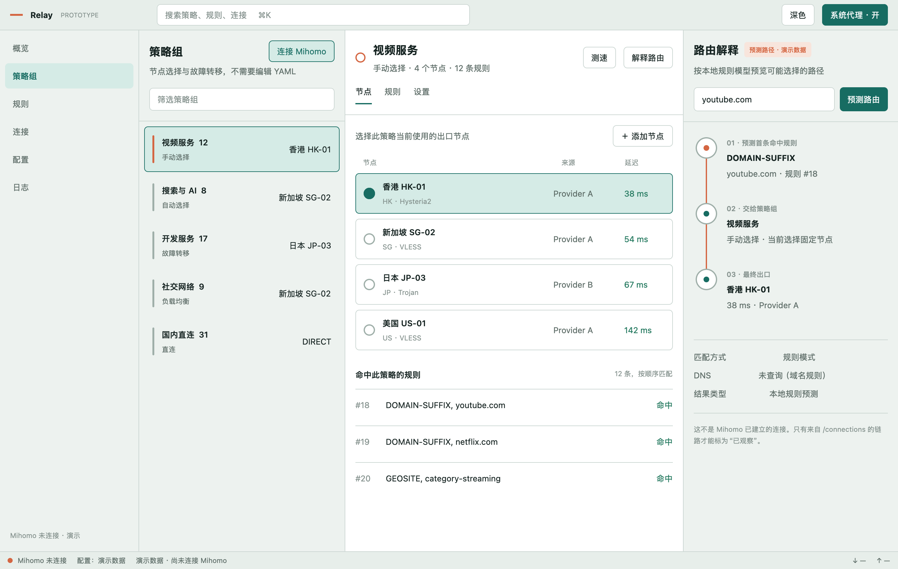

# Relay

Relay 是一个使用 Rust 与 GPUI 构建的跨平台代理策略工作台。它借鉴 Quantumult X 易于理解的“规则 → 策略组 → 节点”工作流，但不复制其界面，也不要求用户先学会编辑 YAML。



## 当前里程碑

- 原生 GPUI 窗口，可在宽、中、窄三档尺寸间自适应
- 一键读取 Mihomo 策略组、节点、规则、延迟与活跃连接；未连接时保留演示状态
- 可解释的本地路由预测链，并明确区别于 Mihomo 已观察连接
- 浅色/深色主题、系统代理演示开关与键盘可聚焦控件
- macOS 原生运行和 Metal 离屏截图已验证
- Windows、Linux 已配置对应的 GPUI 平台依赖，仍需各自原生 CI/设备验证

当前 Mihomo 集成严格只读：点击“连接 Mihomo”后仅请求官方的 `GET /version`、`GET /proxies`、`GET /rules` 和 `GET /connections`。它不会修改 Mihomo 配置、切换节点或改动系统代理设置。

## 运行

仓库通过 `rust-toolchain.toml` 固定 Rust 工具链。macOS 需要 Xcode Command Line Tools；Linux 还需要 Wayland/X11 的系统开发库。

```bash
cargo run -p relay-ui
```

默认连接 `http://127.0.0.1:9090`。如果 Mihomo 配置了 `secret`，或控制器使用了其他本机回环端口，可通过环境变量启动：

```bash
RELAY_MIHOMO_CONTROLLER=http://127.0.0.1:9090 \
RELAY_MIHOMO_SECRET='your-controller-secret' \
cargo run -p relay-ui
```

这一里程碑的标准库 HTTP 传输只允许 `localhost`、IPv4/IPv6 回环地址，避免通过明文网络泄露控制器密钥；远程控制器、HTTPS、Unix socket 和 Windows named pipe 尚未支持。Mihomo 需要先启用 [`external-controller`](https://wiki.metacubex.one/en/config/general/)；接口形状参考其[官方 API 文档](https://wiki.metacubex.one/en/api/)。

## 验证

```bash
cargo fmt --all -- --check
cargo test --workspace --all-targets
cargo clippy --workspace --all-targets -- -D warnings
```

macOS 可额外生成全部原生视觉与交互状态截图：

```bash
cargo run -p relay-ui --example snapshot
```

输出位于 `.impeccable/review/native-*.png`。截图直接来自 GPUI 渲染纹理，不依赖系统录屏权限。

## 代码结构

- `crates/relay-core`：与渲染框架无关的窗口尺寸、策略选择和路由证据状态
- `crates/relay-mihomo`：只读控制器配置、HTTP 传输、容错 JSON 模型和领域目录映射
- `crates/relay-ui`：GPUI 应用、主题、演示/控制器数据与自适应视图
- `DESIGN.md`：视觉 token、组件和响应式行为
- `GPUI_IMPLEMENTATION.md`：状态边界、事件流和未来 Mihomo API 映射
- `packaging`：各平台打包元数据的起点

GPUI 与 `gpui_platform` 固定到同一个 Zed 提交，避免跟随 `main` 漂移。后续优先补齐持续刷新、Windows/Linux 原生 CI 和安全写入命令，再考虑真实节点切换与系统代理控制。
