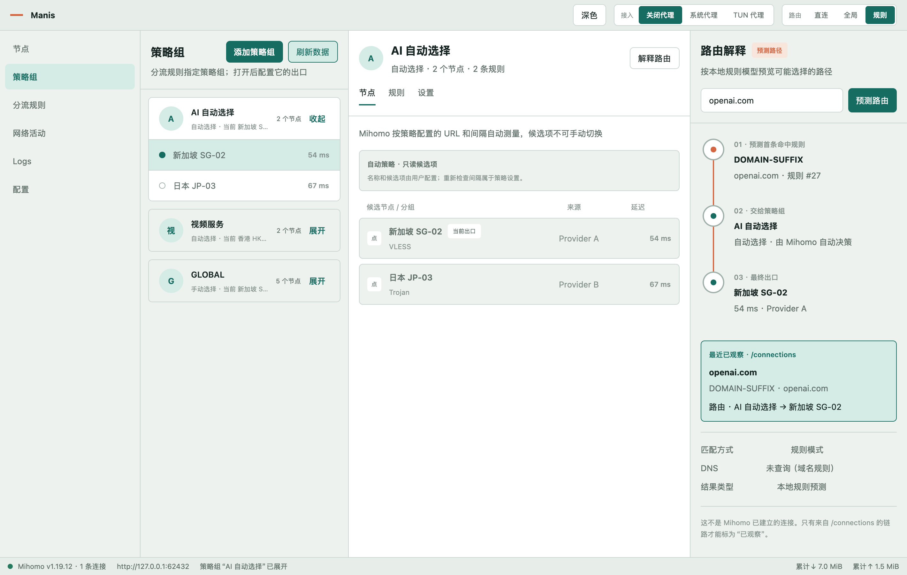

# Manis

[](https://github.com/kaigedong/Manis/actions/workflows/ci.yml)
[](https://github.com/kaigedong/Manis/actions/workflows/security.yml)
[](https://github.com/kaigedong/Manis/actions/workflows/package.yml)
[](LICENSE)

[English](README.md) · **简体中文**

Manis 是一个使用 Rust 与 GPUI 构建的实验性跨平台代理策略工作台。它把“有序规则 → 策略组
→ 节点”作为主要产品模型，让用户不必手写 Mihomo 或 sing-box 配置文件，也能理解并控制
流量最终走向。



> [!WARNING]
> Manis 目前仍是 alpha 软件。macOS 是主要开发和运行验证平台；Windows 与 Linux 已作为
> 编译目标维护，但仍需要更多真实设备测试。请不要在生产机器上把 Manis 当成唯一的网络
> 恢复手段。

## 为什么做 Manis

许多代理客户端会同时暴露订阅、模式、策略组和配置文件，却没有直观说明它们如何组合。
Manis 把下面这条链路直接呈现给用户：

```text
有序规则 -> 策略组 -> 最终节点
```

- 分流规则决定一条连接进入哪个策略组。
- 手动策略组使用用户在组内选中的节点。
- 自动策略组测速后，按照配置的策略自动选择候选节点。
- 全局模式使用“节点”页面中激活的全局出口。
- 网络活动明确区分内核已经观察到的事实和本地规则预测。

项目借鉴 Quantumult X 容易理解的策略工作流，但不复制其界面或配置格式。

## 当前能力

- 原生自适应 GPUI 界面，支持中英文、浅色和深色模式。
- HTTP/HTTPS 订阅与 VLESS 导入，并在本地进行私有持久化。
- 手动、延迟优选、故障转移和负载均衡策略模型；不可用能力由内核能力门禁控制。
- 有序分流规则、QX 规则列表导入、域名与端口组合匹配、明确的兜底规则。
- 订阅来源和策略组测速，逐节点增量展示结果。
- 直连、全局和规则三种路由模式。
- 系统 HTTP/SOCKS 代理控制与 macOS TUN 集成。
- 活跃连接、真实路由证据、内核日志和脱敏的应用诊断。
- 以 Mihomo 为主要托管内核，并提供按能力启用的 sing-box 适配器。

Manis 仓库不包含、也不会自动下载代理内核。应用只寻找用户提供的可执行文件，而且只管理
由自己启动的子进程。

## 平台状态

| 平台 | 编译目标 | 运行状态 |
| --- | --- | --- |
| macOS 13+ | 持续维护 | 主要开发平台；系统代理和 TUN 已进行人工测试 |
| Windows | 持续维护 | 实验性；当前主要使用外部本机回环控制器 |
| Linux | 持续维护 | 实验性；仍需覆盖更多发行版与桌面环境 |

CI 会检查三个平台，但“能够编译”不代表该平台上的所有网络集成都已经完成真实验证。

Package workflow 会分别构建 Apple Silicon、Intel 的未签名 macOS 应用包，以及支持原生
Wayland 的实验性 Arch Linux `x86_64` 软件包。这些 Actions 产物不包含代理内核，也不是
经过公证的正式发行版。安装前请阅读 [macOS](packaging/macos/README.md) 与
[Arch Linux](packaging/archlinux/README.md) 打包说明。

## 从源码运行

仓库通过 `rust-toolchain.toml` 固定 Rust 工具链，并在 `crates/manis-ui/Cargo.toml` 中固定
GPUI 版本。macOS 需要 Xcode Command Line Tools；Linux 需要 GPUI 使用的 Wayland/X11、
GTK 3、fontconfig 与 ALSA 开发包。

```bash
git clone https://github.com/kaigedong/Manis.git
cd Manis
cargo run -p manis-ui
```

如果没有保存任何来源，也没有显式配置 controller，Manis 会尝试连接
`http://127.0.0.1:9090`。使用其他本机 controller：

```bash
MANIS_MIHOMO_CONTROLLER=http://127.0.0.1:9090 \
MANIS_MIHOMO_SECRET='controller-secret' \
cargo run -p manis-ui
```

macOS 与 Linux 也可以使用 Unix socket：

```bash
MANIS_MIHOMO_CONTROLLER=unix:///path/to/mihomo.sock cargo run -p manis-ui
```

TCP controller 只允许回环地址；Unix socket 在连接前会检查类型与符号链接，TCP bearer
secret 不会被转发到 Unix socket。

## 开发验证

```bash
cargo fmt --all -- --check
cargo check --workspace --all-targets --locked
cargo test --workspace --all-targets --locked
cargo clippy --workspace --all-targets --locked -- -D warnings
```

真实内核和在线 controller 测试默认忽略，必须通过环境变量显式开启，并使用合成测试数据。
私人订阅不能进入 Git 或公开测试输出。完整贡献流程见 [CONTRIBUTING.md](CONTRIBUTING.md)。

## 安全与隐私

订阅链接、token、节点凭据、controller secret 和生成的内核配置都属于私有数据。Manis 将
其保存到平台用户数据目录，并从自身诊断日志中脱敏。明文 HTTP 订阅在网络上天然可见，应
优先使用 HTTPS。

macOS TUN 使用固定用途的特权 helper；仅供本地调试的不安全 helper 构建绝不能分发。
测试特权能力前请阅读 [SECURITY.md](SECURITY.md)，安全漏洞请通过 GitHub 私有漏洞报告提交。

## 仓库结构

| 路径 | 职责 |
| --- | --- |
| `crates/manis-core` | 与内核无关的策略、路由证据和应用状态 |
| `crates/manis-engine` | 内核发现、校验、进程所有权和生命周期 |
| `crates/manis-profile` | 类型化配置，以及 Mihomo/sing-box 配置编译 |
| `crates/manis-mihomo` | 受限的 Mihomo controller 传输和领域映射 |
| `crates/manis-ui` | GPUI 应用、持久化边界和平台集成 |
| `packaging/macos` | macOS 打包与固定用途的特权 helper |
| `packaging/archlinux` | 支持 Wayland 的实验性 Arch Linux 软件包 |
| `docs` | 架构、设计和维护者文档 |

相关文档：

- [产品原则](PRODUCT.md)
- [设计系统](DESIGN.md)
- [GPUI 实现说明](GPUI_IMPLEMENTATION.md)
- [开发指南（英文）](docs/development.md)
- [直连与组合规则](docs/architecture/direct-rules.md)
- [macOS 打包](packaging/macos/README.md)
- [发布检查清单](docs/maintainers/release-checklist.md)

## 许可证

Manis 源码使用 [Apache License 2.0](LICENSE)。Rust 链接依赖和可选代理内核拥有各自的
许可证，其中包含 GPL 组件。本仓库不存放预编译代理内核；分发二进制前必须阅读
[THIRD_PARTY_NOTICES.md](THIRD_PARTY_NOTICES.md)。
